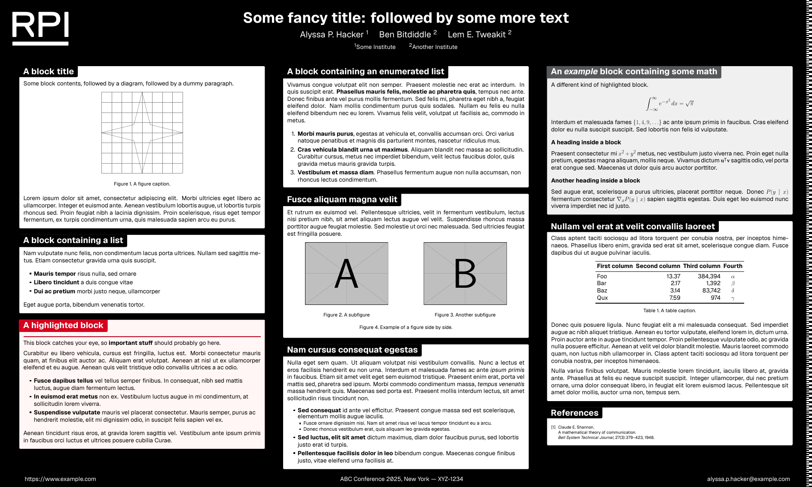

# RPI Poster Theme

An unofficial RPI LaTeX [beamerposter] theme, based on [Gemini].

This template uses the updated RPI branding direction with a black primary background, white RPI logo, and bundled RPI Geist fonts.

## Preview



## Dependencies

* A TeX installation that includes [LuaTeX]
* `latexmk`
* LaTeX package dependencies including beamerposter, Beamer, TikZ, and PGFPlots
* The bundled RPI Geist font files in `fonts/`
* Optional for preview generation: Poppler's `pdftoppm`

## Usage

1. Copy or clone this repository.
2. In `poster.tex`, set your paper size, title, authors, column layout, and content.
3. Build with:

   ```sh
   latexmk poster.tex
   ```

4. Generate or refresh the PNG preview from the PDF with:

   ```sh
   scripts/generate-preview.sh
   ```

The poster uses `\usetheme{rpi}` and `\usecolortheme{rpi}` by default.

## License

Copyright (c) Anish Athalye. Released under the MIT License. See
[LICENSE.md][license] for details.

[beamerposter]: https://github.com/deselaers/latex-beamerposter
[Gemini]: https://github.com/anishathalye/gemini
[LuaTeX]: http://www.luatex.org/
[license]: LICENSE.md
